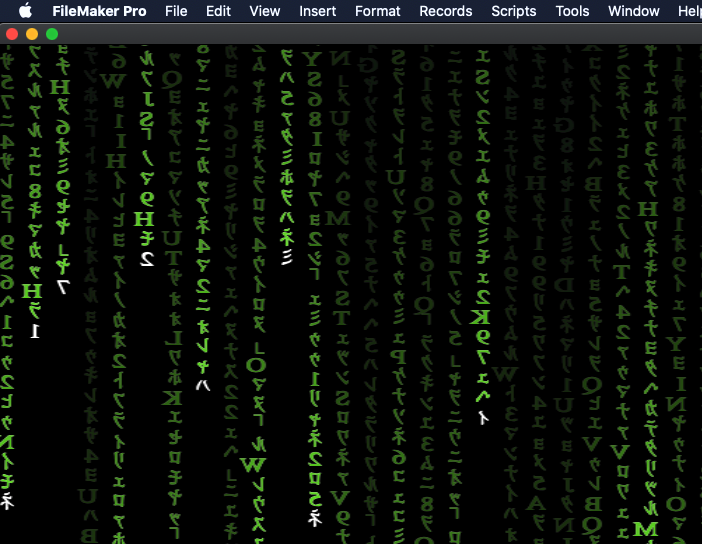

# Matrix Digital Rain

#### A FileMaker Pro Add-On

Bringing the Matrix to FileMaker. Glorious animated eye-candy!

#### Installation

1. Download "MatrixDigitalRain.fmaddon"

2. Double-click the downloaded file to open FileMaker Pro and it will be automatically installed into the correct directory

3. Open or create the database you wish to add "MatrixDigitalRain" to

4. Create a new, empty "Form" layout

5. In Layout mode, make sure that you have the left side "Objects" pane visible, and click on the "Add-ons" tab

6. Click on the Add "+" button (lower right of pane)

7. Scroll thru the list of possible Add-Ons and select "MatrixDigitalRain" and click "Choose" button

8. Drag newly added Add-On icon over into the layout body

9. Add-On has now been installed, adding the following:
  * 1 new Scripts: "Matrix Digital Rain ( whichPill )"
  * "MatrixDigitalRain" Table with 5 Fields and 1 Record
  * 2 new Layouts: "MatrixDigitalRain_Launch" & "MatrixDigitalRain"

10. Navigate to the new layout "MatrixDigitalRain_Launch"

#### Usage

1. Press the "blue pill" button and enjoy your eye-candy

2. To use the "red pill" properly (in order to enter FullScreen) you will need to follow the provided instructions on how enable the necessary MacOS security settings

#### Dependancies

None
